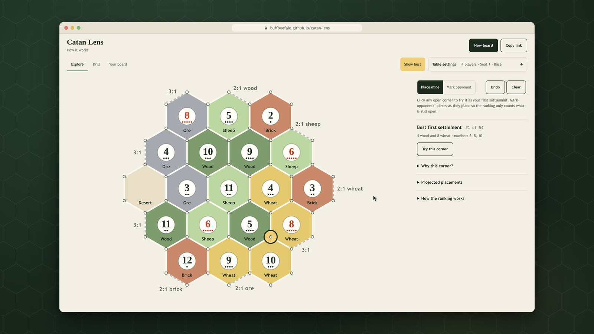
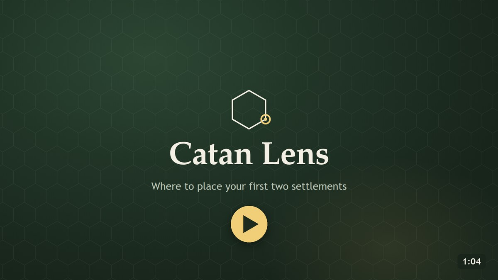
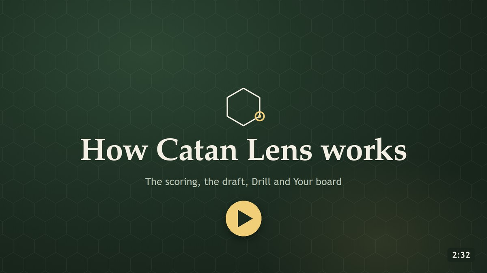
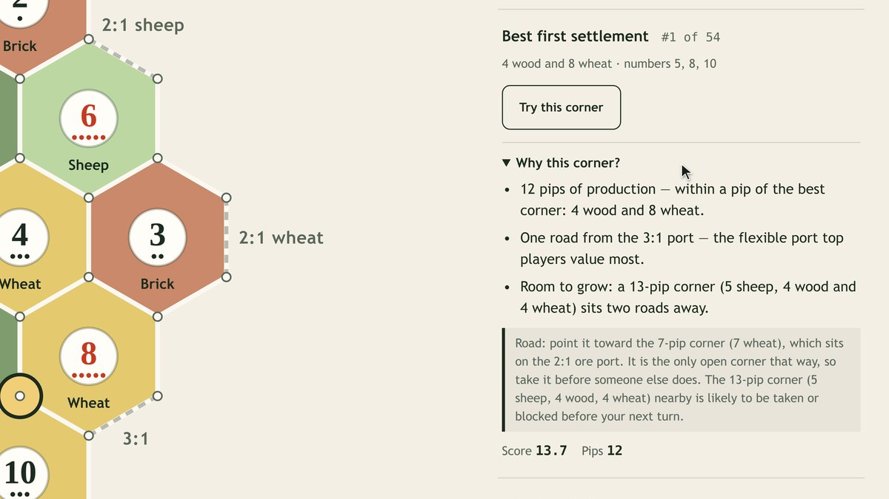
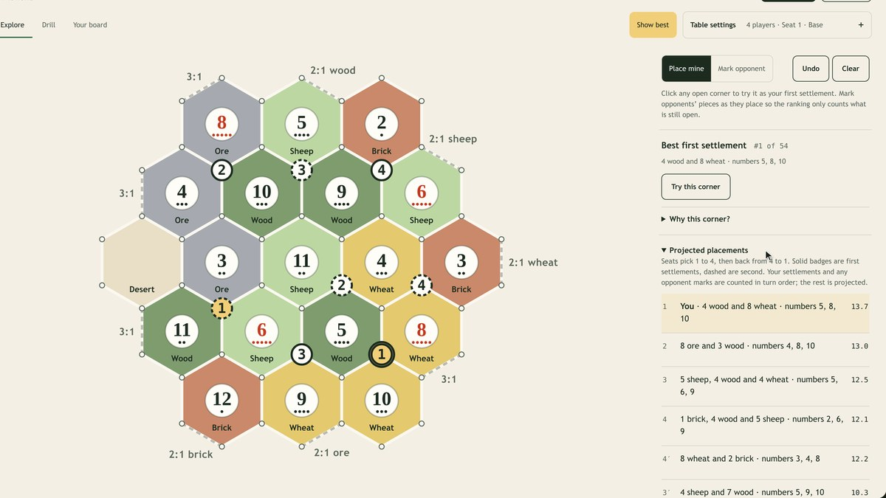
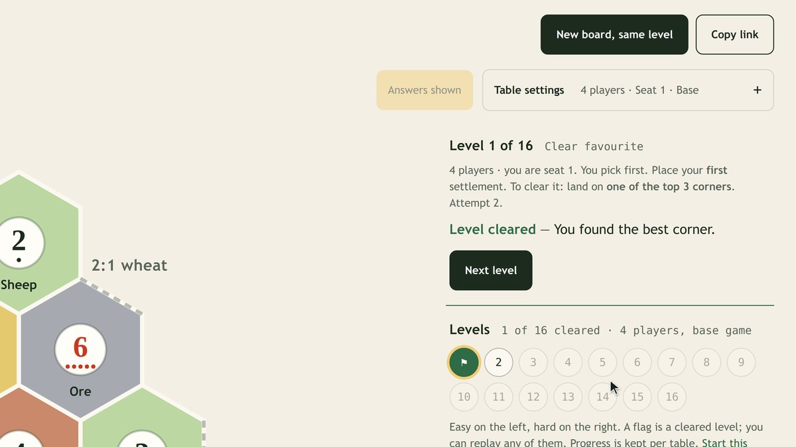
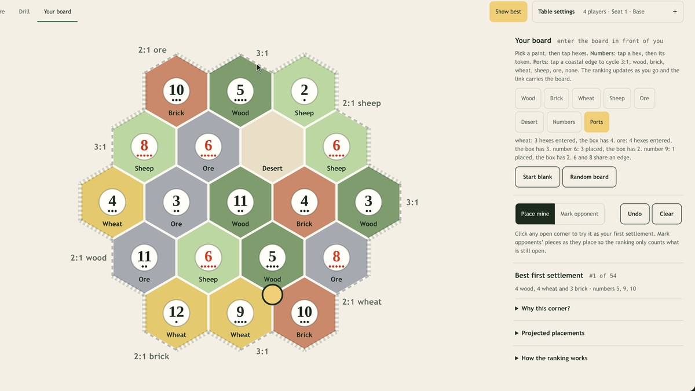

<div align="center">

<picture>
  <source media="(prefers-color-scheme: dark)" srcset="docs/media/logo-dark.svg">
  
</picture>

# Catan Lens

**Where should I put my first two settlements?**

Catan Lens scores every legal corner on a Catan board with rules that strong players agree on,<br>
and explains the best spot in plain sentences. Free, open source, and it runs entirely in your browser.

[](https://github.com/buffbeefalo/catan-lens/actions/workflows/ci.yml)
[](https://github.com/buffbeefalo/catan-lens/releases/latest)
[](LICENSE)
[](package.json)

**[Open the app](https://buffbeefalo.github.io/catan-lens/)** &nbsp;·&nbsp; **[Watch the videos](https://buffbeefalo.github.io/catan-lens/how-it-works.html)** &nbsp;·&nbsp; **[Read how it works](docs/HOW-IT-WORKS.md)**

<a href="https://buffbeefalo.github.io/catan-lens/"></a>

</div>

## See it in action

<table>
<tr>
<td width="50%"><a href="https://buffbeefalo.github.io/catan-lens/how-it-works.html#overview"></a></td>
<td width="50%"><a href="https://buffbeefalo.github.io/catan-lens/how-it-works.html#walkthrough"></a></td>
</tr>
<tr>
<td><b>Catan Lens in one minute</b><br>The best corner, why it wins, and how your own pick compares.</td>
<td><b>How Catan Lens works</b><br>The scoring, the snake draft, Drill mode and entering your own board.</td>
</tr>
</table>

## What it does

<table>
<tr>
<td width="50%"></td>
<td width="50%"></td>
</tr>
<tr>
<td><b>The best corner, explained.</b> Random boards follow the official setup (3–4 players, or the 5–6 player board). A gold ring marks the best open corner; <i>Why this corner?</i> gives the reasons in plain sentences. Click any other corner for a grade and exactly what the best one has that yours lacks.</td>
<td><b>Plays out the draft.</b> Mark opponents as they place and the ranking only counts what is still open. <i>Projected placements</i> plays the snake draft for every seat, and the suggested starting road avoids corners others are likely to take first.</td>
</tr>
<tr>
<td></td>
<td></td>
</tr>
<tr>
<td><b>Drill until it is second nature.</b> Sixteen levels, easy to hard, on the table you choose. Hints stay hidden until you commit; a miss shows your rank and offers a fresh board at the same level.</td>
<td><b>Use your real board.</b> Paint the board in front of you, set its numbers and harbours, and every ranking applies to it. The link carries the whole board, so your table can open it too.</td>
</tr>
</table>

No account, no tracking, no server: the app is plain HTML, CSS and JavaScript modules with zero runtime dependencies.

<sub>Unofficial fan tool, not affiliated with or endorsed by Catan GmbH or Catan Studio. CATAN is a trademark of Catan GmbH.</sub>

## How it works

The score for a corner starts with **production** (the dots on the surrounding number tokens: the ways, out of 36,
that two dice roll each number), weighted by how valuable and how scarce each resource is on this board. Small
bonuses go to wood+brick and wheat+ore pairs, a harbour you can feed, and room to grow; repeating a number costs a
little; a second settlement gets credit for covering what the first lacks. Every rule traces to a published source
(King of Catan's expert group, Colonist.io champion interviews, a 400-game statistical study, the standard Cities &
Knights guide, an IEEE paper on Catan agents).

- [docs/HOW-IT-WORKS.md](docs/HOW-IT-WORKS.md): the full explanation in plain English
- [docs/RESEARCH.md](docs/RESEARCH.md): every source, every weight, and what was deliberately left out
- [docs/ARCHITECTURE.md](docs/ARCHITECTURE.md): how the code fits together

## Does following it win?

Advice is not proof, so this repository tests it. [`bench/catanatron`](bench/catanatron) plays complete four-player
games in [Catanatron](https://github.com/bcollazo/catanatron), an open-source Catan engine with strong bots. Every
seat is Catanatron's value-function bot; one seat's opening settlements come from a different strategy, then it plays
on exactly like the others. Every strategy sees the same boards and seat orders, and the whole benchmark is repeated
under 20 different bot tie-breaking orders, with intervals computed across those runs (see
[HOW-IT-WORKS](docs/HOW-IT-WORKS.md#5-does-following-it-actually-win-games) for why). A fair seat wins 25%.

| Opening chosen by | Win rate (95% interval) | Games |
|---|---|---|
| Catan Lens settlements and road | 25.2% ± 1.2 | 8,000 |
| Catan Lens settlements, bot's roads | 24.9% ± 1.2 | 8,000 |
| The bot's own opening | 25.8% ± 1.3 | 8,000 |
| Most pips | 16.9% ± 0.9 | 8,000 |
| Random corner | 1.8% ± 0.3 | 8,000 |

These are bot games: they show the advice is sound, not how much it will raise your own win rate. A deterministic
report of what each strategy's opening looks like (`npm run report`) shows why: taking the most pips wins raw
production, as it must by construction, but the openings Catan Lens picks cover more resources, spread across more
numbers, and hold far more of the wheat/ore pair that builds cities.

## Run it

Node 22 or newer. No install is needed to run the app:

```sh
npm start          # http://127.0.0.1:8080/
npm test           # unit tests (scoring, geometry, board generation, drill)
npm install        # once, for the browser tests
npx playwright install chromium
npm run e2e        # browser walkthroughs and interaction tests against the local server
npm run report     # the deterministic opening report
```

Any static file host works: the app is plain HTML, CSS and JavaScript modules in [`public/`](public).

## Build on it

Ideas and fixes are welcome; see [CONTRIBUTING.md](CONTRIBUTING.md). Good places to start: a denial term (valuing the
corners your pick takes away from others), Seafarers boards, real Cities & Knights rules instead of re-weighting,
translations, or new drill levels. Keep every scoring change tied to a source in RESEARCH.md and to a test.

## The demo videos

Both videos are rebuilt from the real app by [`video/`](video): a script drives the app, the corners it clicks come from
the app's own scoring code, and a renderer draws the camera moves, cursor and cards frame by frame. The narration is
spoken locally by [Qwen3-TTS](https://huggingface.co/Qwen/Qwen3-TTS-12Hz-1.7B-CustomVoice) (Apache-2.0); every line is
checked word for word by a speech recogniser, and `video/qa.py` checks loudness, sync, captions and picture quality
before a release. See [video/README.md](video/README.md).

## License

[MIT](LICENSE), except [`bench/catanatron/`](bench/catanatron), which imports the GPL-licensed Catanatron and is
therefore GPL-3.0-or-later (see [NOTICE](NOTICE)).
